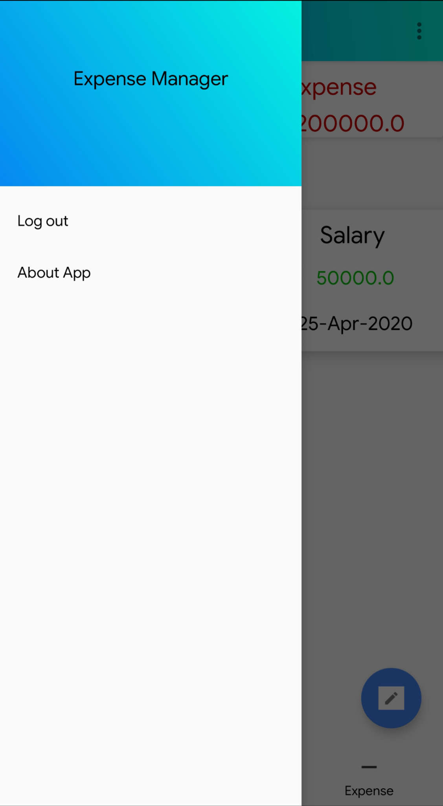

# ExpenseManager
A simple app to keep track of your income and expenses using Firebase as server
Some of the Key features of the app include:
•	User login/registration and forget password feature using firebase
•	User can login with email and password 
•	Editable fields
•	Category creation and edition – each category gets assigned a different color to easily differentiate from one another
•	Income is shown in green and expenses are shown in red 
•	The app follows Google’s material design guidelines
•	The user data is stored on the firebase server

# Screenshots

  

 

  

 

